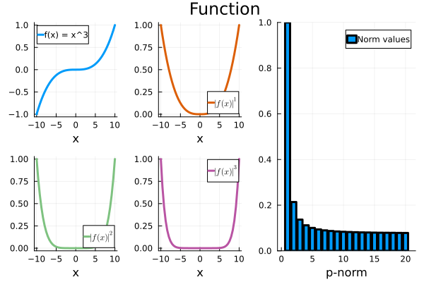

# Chapter 2 - Norms for Signals and Systems
As mentioned, we which to describe the performance of the control system in terms of the size of certain signals. 

## Norms for signals
When playing around with norms of signals, we need to be precise about what sorts of signals we are interested in. For many control systems we talk about piecewise continous signals that maps from an interval $(-\infty, \infty)$ to $\mathbb{R}$. This would be a time-series signal. We then define the p-norm:

$$|| u(t) ||_p = \left(\int_{-\infty}^{\infty}\vert u(t)\vert^p\right)^{\frac{1}{p}}$$

**STEPS**: 

1. Figure to get a general idea about what the different norms look like on a signal. Talk about the power of the signal and then the rooting of the signal and its significance on the norm-value. 

2. Supremum vs. Maximum: The function x(t) = 1-1/t approaches 1 as t approaches infinity, but never actually equals 1 for any finite time t. So, in this case, 1 is the supremum (the least upper bound), that is sup of x(t) in interval [a,b] is the smallest value M, such that x(t) <= M for all t in interval [a,b].

